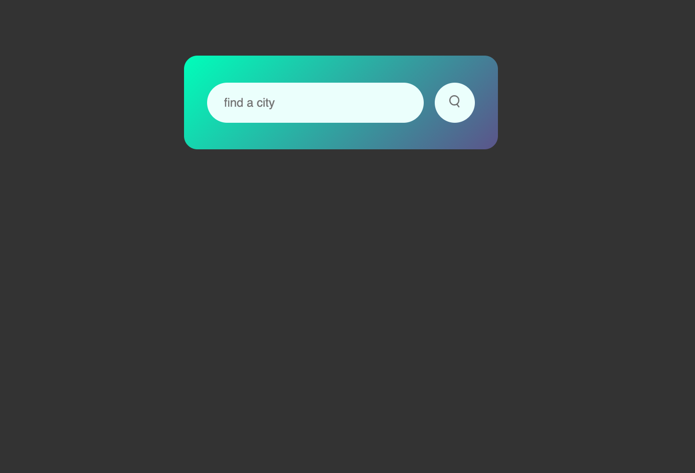

# Server-Side APIs Challenge // Weather Dashboard

##### _Languages & Tools Used_ 🛠

  

#### _Links_
* <a href="https://github.com/F3N215/Weather-Dashboard-Challenge/blob/main/index.html">HTML</a>
* <a href="https://github.com/F3N215/Weather-Dashboard-Challenge/blob/main/Assets/css/style.css">CSS</a>
* <a href="https://github.com/F3N215/Weather-Dashboard-Challenge/blob/main/Assets/js/script.js">JS</a>

-----
## Project Summary 📋
* Using third-party APIs from OpenWeatherMap, FontAwesome & Bootstrap, the challenge is to build a 5 day forecast app
* The app runs in the browser and features dynamically updated HTML and CSS elements
* The app must use localStorage to store persistent data from searched cities and show previous searches
-----
# Initial Work & Study 💻

 
* Searched through previous classes, online tutorials on API integration, learning Xpert
* Scheduled regular meetings with my mentor 
* Goal: to understand how use dynamic HTML elements built through JS
* Created a sample weather app prototype (single day forecast) to get a sense of style and placement 
* Completed side project prototype:

# Collaboration Workflow 🦾
* After reviewing some of my work with my mentor who helped further my understanding, I reworked the JavaScript to “clean it up”
* Requested information details from Xpert Learning Assistant for assistance on proper syntax and understanding logic behind the code
* Finally, reviewed additional JavaScript course materials and connected a final time with my mentor

-----
## Summary of Challenges 📝



JavaScript
* Integrating changes to the base URL for the code took considerable time to get correct
* Using updated ES6 knowledge from Node.js Day 1 helped refine a lot of my code 
* Was unable to figure out localStorage for persistent data and previously searched cities

CSS
* Using Bootstrap elements makes it difficult to target elements for customized styles 
* Learned to use !important to override specific styles implemented by Bootstrap
* Need to review CSS code to remove repeated or unused elements 

-----
## Screenshots 📸
* 
* 
* <a href="https://streamable.com/il7rqw">Short Screen Recording</a>

-----
## About Me
<h3 align="left">Hey there! I'm Dan 👋 I'm a junior fullstack webdev</h3>

* 🔭 I’m currently working on occult projects, SMBs & personal pages
* 🌱 I’m currently learning HTML5, CSS, & JavaScript
* 📫 Email me **dcampo85@gmail.com**

<h6 align="left">Connect with me:</h6>

